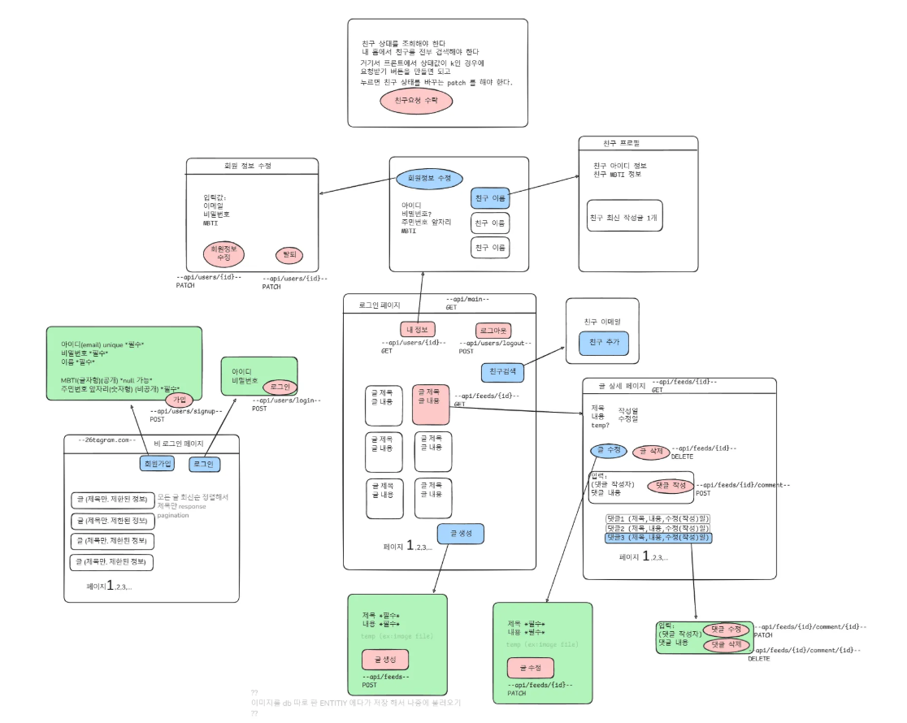
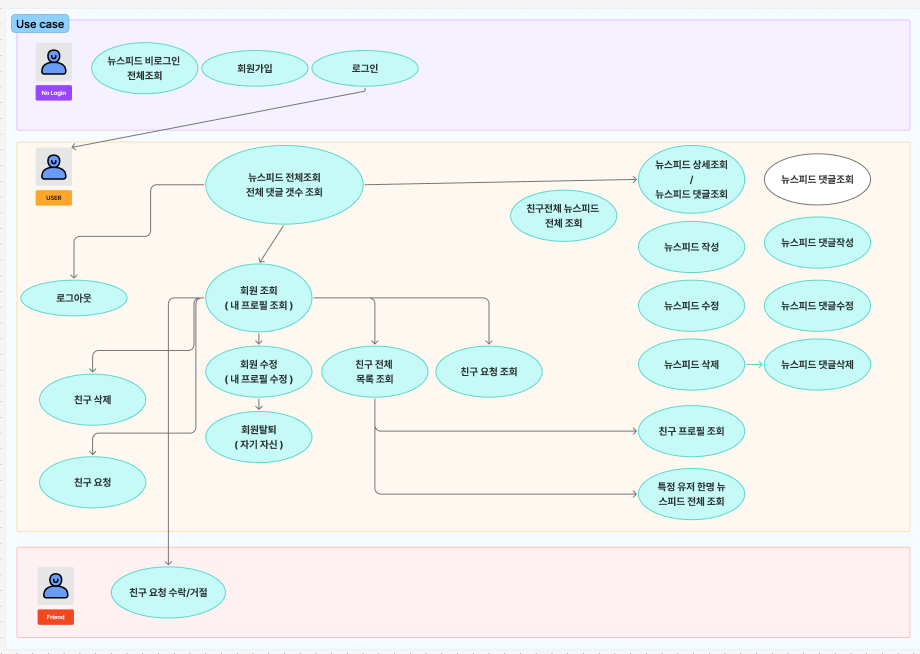

# 📘 뉴스피드 프로젝트


## 팀명 - 이륙하자 (26조)

| 담당자 | 기능 영역       | 주요 API                                                                                                              | 설명 | 비고 |
|--------|-------------|---------------------------------------------------------------------------------------------------------------------|------|------|
| 김광민 | 피드(Feed)    | `/api/feeds`, `/api/feeds/{feedId}`, `/api/feeds/public` 등                                                          | 피드 생성, 조회, 수정, 삭제 | 로그인/비로그인 구분 |
| 김영대 | 친구(Friend)  | `/api/friends/{userId}`, `/api/friends/requests`, `/api/friends/accept/{userId}`, `/api/friends/profile/{userId}` 등 | 친구 요청, 수락, 삭제, 프로필 조회 | |
| 박민혁 | 유저(User)    | `/api/users/signup`, `/api/users/login`, `/api/users/me`, `/api/users/logout`, `/api/users/me` (PATCH, DELETE) 등    | 회원가입, 로그인, 내 정보 조회/수정/탈퇴 | 세션 기반 |
| 지송이 | 댓글(Comment) | `/api/feeds/{feedId}/comments`, `/api/feeds/{feedId}/comments/{commentId}` 등                                        | 댓글 작성, 수정, 삭제, 조회 | 피드 기반 댓글 |

## 📁 프로젝트 폴더 구조

```plaintext
.
├── README.md
├── build.gradle
├── gradle
│   └── wrapper
│       ├── gradle-wrapper.jar
│       └── gradle-wrapper.properties
├── gradlew
├── gradlew.bat
├── img.png
├── settings.gradle
├── src
│   ├── main
│   │   ├── java
│   │   │   └── org
│   │   └── resources
│   │       └── application.properties
│   └── test
│       └── java
│           └── org
└── tree.md
```
## 👾 ERD


## 🌈 와이어프레임




## 🚥 UML 다이어그램 (행위 다이어그램)


## 📌 API 명세서

| Method | Endpoint | Description | Request | Response |
|--------|----------|-------------|---------|----------|
| `POST` | `/api/users/signup` | 회원가입 | {"email": "test@example.com", "password": "1234", "name": "홍길동"} | {"status": 201, "message": "회원가입이 완료되었습니다."} |
| `POST` | `/api/users/login` | 로그인 | {"email": "test@example.com", "password": "1234"} | {"status": 200, "message": "로그인이 완료되었습니다."} |
| `POST` | `/api/users/logout` | 헤더: Authorization: Bearer {token} | {} | {"status": 200, "message": "로그아웃이 완료되었습니다."} |
| `GET` | `/api/users/me` | 내 정보 조회 | 헤더: Authorization: Bearer {token} | {"id": 1, "email": "test@example.com", "name": "홍길동"} |
| `PATCH` | `/api/users/me` | 내 정보 수정 | {"name": "고길동"} | {"status": 200, "message": "회원 정보가 수정되었습니다."} |
| `DELETE` | `/api/users/me` | 회원 탈퇴 | 헤더: Authorization: Bearer {token} | {"status": 200, "message": "회원 탈퇴가 완료되었습니다."} |
| `GET` | `/api/feeds/public` | 전체 피드 조회 (비로그인) | 없음 | [{"id": 1, "title": "첫 피드", "author": "홍길동"}] |
| `GET` | `/api/feeds` | 전체 피드 조회 (로그인) | 헤더: Authorization: Bearer {token} | [{"id": 1, "title": "첫 피드", "author": "홍길동"}] |
| `GET` | `/api/feeds/friends` | 친구들의 피드 조회 | 헤더: Authorization: Bearer {token} | [{"id": 2, "title": "친구 피드", "author": "김철수"}] |
| `GET` | `/api/feeds/user/{userId}` | 특정 친구 피드 조회 | 헤더: Authorization: Bearer {token} | [{"id": 3, "title": "친구 피드"}] |
| `GET` | `/api/feeds/{feedId}` | 피드 상세 조회 | 헤더: Authorization: Bearer {token} | {"id": 1, "title": "상세 피드", "author": "홍길동", "content": "내용"} |
| `POST` | `/api/feeds` | 피드 작성 | {"title": "제목", "content": "내용"} | {"id": 10, "title": "제목", "content": "내용"} |
| `PATCH` | `/api/feeds/{feedId}` | 피드 수정 | {"title": "수정제목", "content": "수정내용"} | {"id": 10, "title": "수정제목", "content": "수정내용"} |
| `DELETE` | `/api/feeds/{feedId}` | 피드 삭제 | 헤더: Authorization: Bearer {token} | {"status": 200, "message": "피드가 삭제되었습니다."} |
| `GET` | `/api/feeds/{feedId}/comments` | 댓글 목록 조회 | 헤더: Authorization: Bearer {token} | [{"id": 1, "contents": "댓글입니다.", "author": "홍길동"}] |
| `POST` | `/api/feeds/{feedId}/comments` | 댓글 작성 | {"contents": "댓글입니다."} | {"id": 1, "contents": "댓글입니다.", "author": "홍길동"} |
| `PATCH` | `/api/feeds/{feedId}/comments/{commentId}` | 댓글 수정 | {"contents": "수정된 댓글"} | {"id": 1, "contents": "수정된 댓글", "author": "홍길동"} |
| `DELETE` | `/api/feeds/{feedId}/comments/{commentId}` | 댓글 삭제 | 헤더: Authorization: Bearer {token} | {"status": 200, "message": "댓글이 삭제되었습니다."} |
| `POST` | `/api/friends/{userId}` | 친구 요청 보내기 | 헤더: Authorization: Bearer {token} | {"status": 200, "message": "친구 요청을 보냈습니다."} |
| `GET` | `/api/friends/requests` | 받은 친구 요청 조회 | 헤더: Authorization: Bearer {token} | [{"fromUser": "홍길동"}] |
| `POST` | `/api/friends/accept/{userId}` | 친구 요청 수락 | 헤더: Authorization: Bearer {token} | {"status": 200, "message": "친구 요청을 수락했습니다."} |
| `DELETE` | `/api/friends/{userId}` | 친구 삭제 | 헤더: Authorization: Bearer {token} | {"status": 200, "message": "친구 삭제가 완료되었습니다."} |
| `GET` | `/api/friends/profile/{userId}` | 친구 프로필 조회 | 헤더: Authorization: Bearer {token} | {"id": 3, "name": "김철수", "mbti": "INTJ"} |
